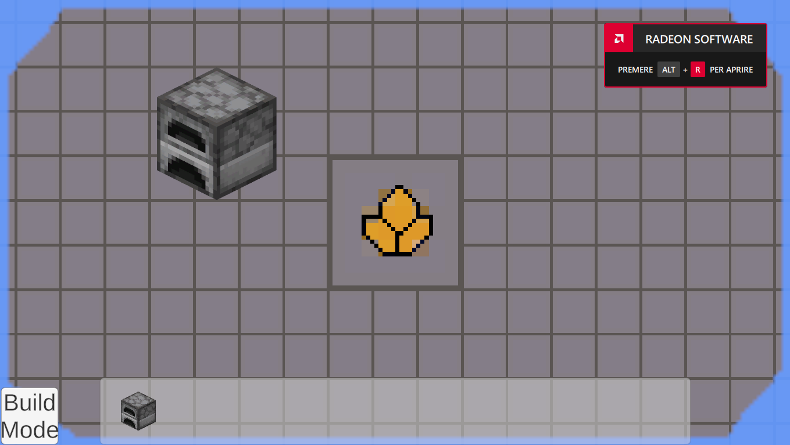
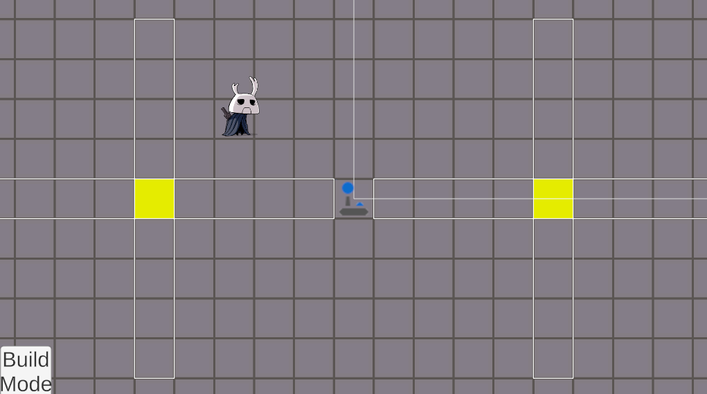

# Base Builder
**Base Builder** is a Unity game project about building an automated planetary base after a spaceship crash.

The player gathers raw resources, refines them into materials and components, and uses a fleet of worker bots to expand the base and ultimately repair the ship.
## Gallery
 Build Menu (Week 1)
 Waypoints (Week 2)

## Project highlights

- Tilemap-based planet map
- Resource gathering, smelting, and crafting
- Electricity system
- Five bot roles: miner, carrier, builder, worker, and specialist
- Progression from the crash site to spaceship repair

## Current systems

- Build-mode placement
- Mineral nodes and raw-resource data
- Machine recipe UI
- Generator and power-pole prototypes
- Waypoint system for future bots pathfinding

## Current status
The game is still in early development, none of the features are fully implemented yet, and the game is not yet playable.
## Installation
Visit the [itch.io page](https://blackhole-studio.itch.io/base-builder=) to download the game.
